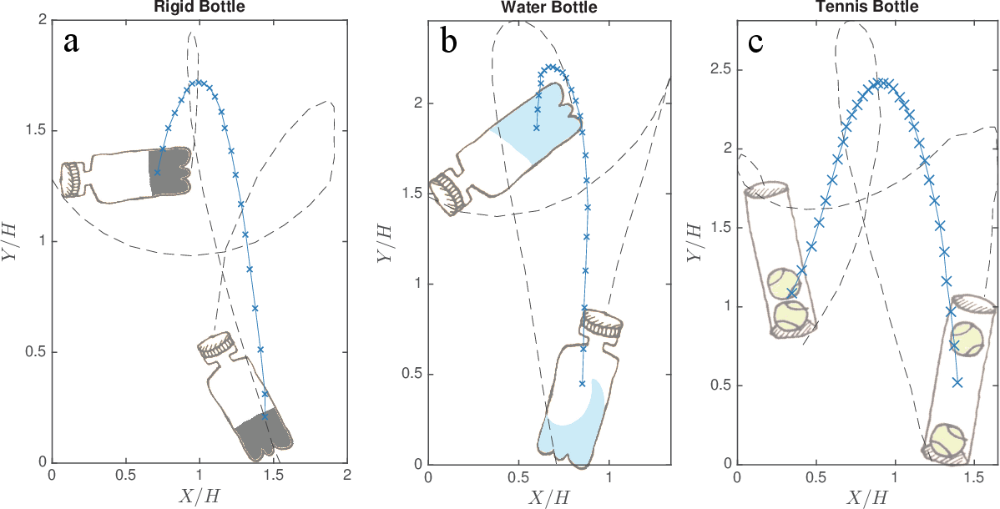

# 03 - MOTION GENERATION MODULE
*Produces a throwing trajectory defined by velocity, angle, and release timing*

*v_001*

## INTRODUCTION
The Motion Generation Module is the subsystem responsible for defining, generating, and parameterizing the robotic arm motion required to fulfill the system’s functional objective: launching a water-filled bottle, inducing a full 360-degree rotation, and enabling a stable upright landing.

This module acts as an intermediary between the system’s abstract design and its physical behavior, establishing the initial launch conditions such as position, velocity, acceleration, and release timing that directly determine the bottle’s rotational outcome.

## TASK TO COMPLETE

1. Motion Primitive Design
2. Motion Parameterization
3. Kinematic Validity & Reusability